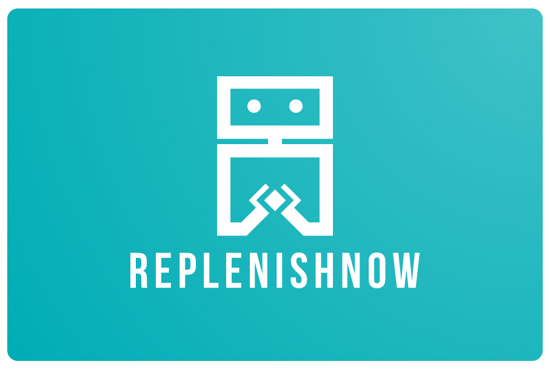

## IRS-PM-2023-05-21-ReplenishNow
---

## SECTION 1 : PROJECT TITLE
## ReplenishNow - demand-driven inventory replenishment recommender




---

## SECTION 2 : EXECUTIVE SUMMARY  

ReplenishNow is a recommendation engine designed for small-to-medium enterprises seeking to improve the accuracy and efficiency of their inventory restocking strategies. The system implements existing industry methods to forecast inbound stock to balance between safeguard against stock-out (no products to fulfill customer orders) whilst minimizing inventory to avoid over stocking (unnecessary overhead and depreciation costs). Under the hood, ReplenishNow uses a combination of machine reasoning and learning to forecast and monitor the supply and demand levels to make daily adjustments to inventory levels in real time.

---

## SECTION 3 : CREDITS / PROJECT CONTRIBUTION

| Official Full Name  | Student ID  | Work Items/Roles | Email |
| :------------ |:---------------:| :-----| :-----|
| Cao Zengyu  | A0214887R | System Design/Architect, Algorithm Developement, Backend Development | e0533381@u.nus.edu |
| ​Benjamin Lim  | A1234567B | Project Management, UI Development | e1114565@u.nus.edu  |
| Toh Zhi Yuan  | A0269367L  | Data Scientist, Development | e1112238@u.nus.edu  |


---

## SECTION 4 : VIDEO OF SYSTEM MODELLING & USE CASE DEMO

[](https://youtu.be/-jP6o8fehffsfsf "ReplenishNow")

Note:
More reference video presentations [here](https://telescopeuser.wordpress.com/2018/03/31/master-of-technology-solution-know-how-video-index-2/ "video presentations")

---

## SECTION 5 : USER GUIDE

`Refer to appendix <Installation & User Guide> in project report at Github Folder: ProjectReport`

### [ 1 ] Retool Platform
> **Go to URL using web browser**:  [ReplenishNow-retool](https://lwmbenjamin.retool.com/embedded/public/65e7a33a-7fd2-459c-b076-9fe725a1cee6)
#### To start your own app:
1. Register account for Retool
2. Check the application components: App, Retool Database, Workflow, etc.
3. Expose the app ready to use

### [ 2 ] Forecasting API
### use the source code zip under SystemCode folder to set up in Azure Function
library required:  ```!pip install pycaret```
> **Use the API deployed**: POST "https://replenishnowforecast.azurewebsites.net/api/ReplenishNowForecast"


### [ 3 ] Forecasting 
### use the optimiser-cloud-function-source.zip file under SystemCode/replenish_optimiser folder to set up in Google Cloud Function 

library required:  functions-framework==3.* & ortools  
> **Use the API deployed**: POST https://function-optimiser-3phvgqtjuq-as.a.run.app 


---
## SECTION 6 : PROJECT REPORT / PAPER

`Refer to project report at Github Folder: ProjectReport`

**Recommended Sections for Project Report / Paper:**
- Executive Summary
- Market Research
- Project Definition
- System Design (Architecture, data flow, modules design, database schema)
- Demand Forecasting (Theory Study and our methodology)
- Replenishment (Theory Study and our methodology)
- System Implementation & testing 
- Project Conclusions: Findings & Recommendation

---
## SECTION 7 : MISCELLANEOUS

`Refer to Github Folder: Miscellaneous`

### Data source
* /raw_data_DMC: raw data from DMC2022 competition  
### Processing files
* inventory.csv, master.csv, sales_order.csv: data being mapped into database tables
* top78Items_aggr_weekly.csv: selected a pool of items from dataset download
### Result files
* item_20109_moq.csv: result of the naive replenishment strategy applied on item 20109 

### System Design
* system_design.drawio: including all the diagrams
### more coming...

---

---

**This project is the practical module of the Analytics and Intelligent Systems and Graduate Certificate in [Intelligent Reasoning Systems (IRS)](https://www.iss.nus.edu.sg/stackable-certificate-programmes/intelligent-systems "Intelligent Reasoning Systems") series offered by [NUS-ISS](https://www.iss.nus.edu.sg "Institute of Systems Science, National University of Singapore").**

**Lecturer: [GU Zhan (Sam)](https://www.iss.nus.edu.sg/about-us/staff/detail/201/GU%20Zhan "GU Zhan (Sam)")**

**zhan.gu@nus.edu.sg**
